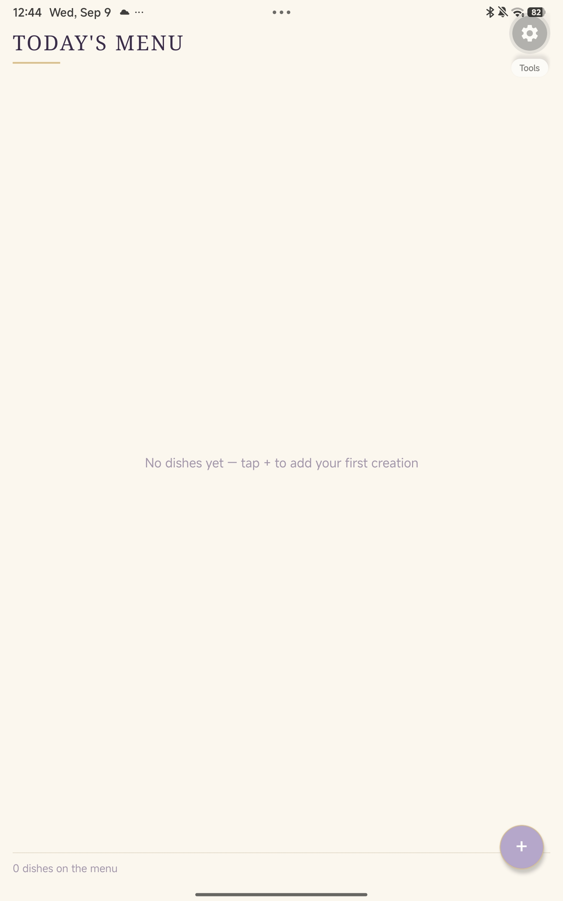
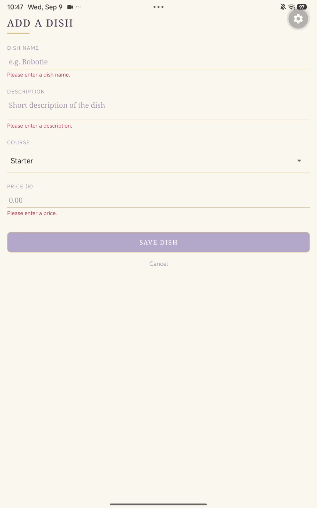
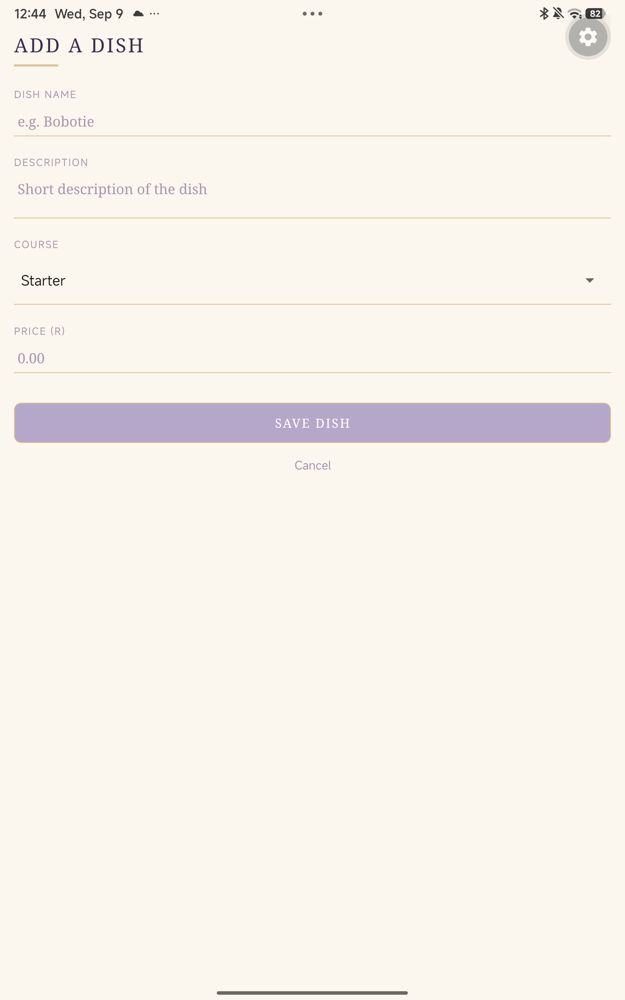
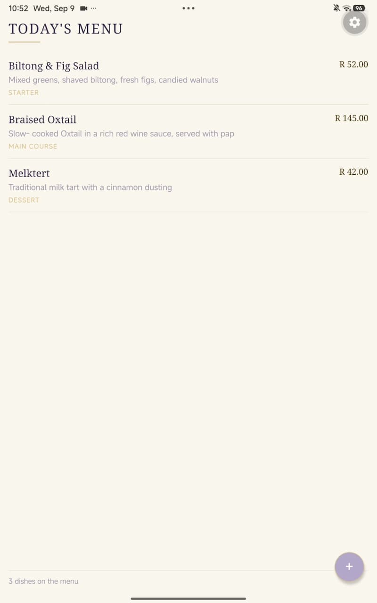

# Chef's Menu Manager — MAST5112 POE Part 2

**Student:** Noluthando Zondi
**Student Number:** ST10531705
**Module:** MAST5112 — Mobile App Scripting

## About This App

A React Native (Expo) mobile application built for Christoffel, a restaurant owner, to help manage his menu digitally instead of on paper. This is the Part 2 submission — the first working version of the app.

## Features Implemented in This Version

- Add new menu items (Dish Name, Description, Course, Price)
- View all menu items in a scrollable list, updating automatically as dishes are added
- Field validation with clear error messages for empty or invalid input
- Success confirmation when a dish is added
- Empty-state message when no dishes have been added yet
- Consistent design system throughout (lavender & champagne palette, carried over from Part 1)

*Note: editing, deleting, searching, filtering, and menu statistics are intentionally not included in this version — those are planned for the Final PoE.*

## Screenshots

### Home Screen — Today's Menu

### Add a Dish Screen

### Validation — Empty Fields

### Menu With All Dishes Added

## Tech Stack

- React Native (Expo)
- React Navigation (native stack)
- @react-native-picker/picker

## Design System

Carried over from the Part 1 planning phase — a "Lavender and Champagne" palette, serif headings paired with sans-serif labels, hairline dividers instead of boxed cards, and consistent letter-spaced uppercase headings across every screen.

## How to Run This Project

1. Clone this repository
2. Run `npm install`
3. Run `npx expo start`
4. Scan the QR code with the Expo Go app on an Android device

## Video Demonstration

https://youtu.be/BA3djBubITQ

